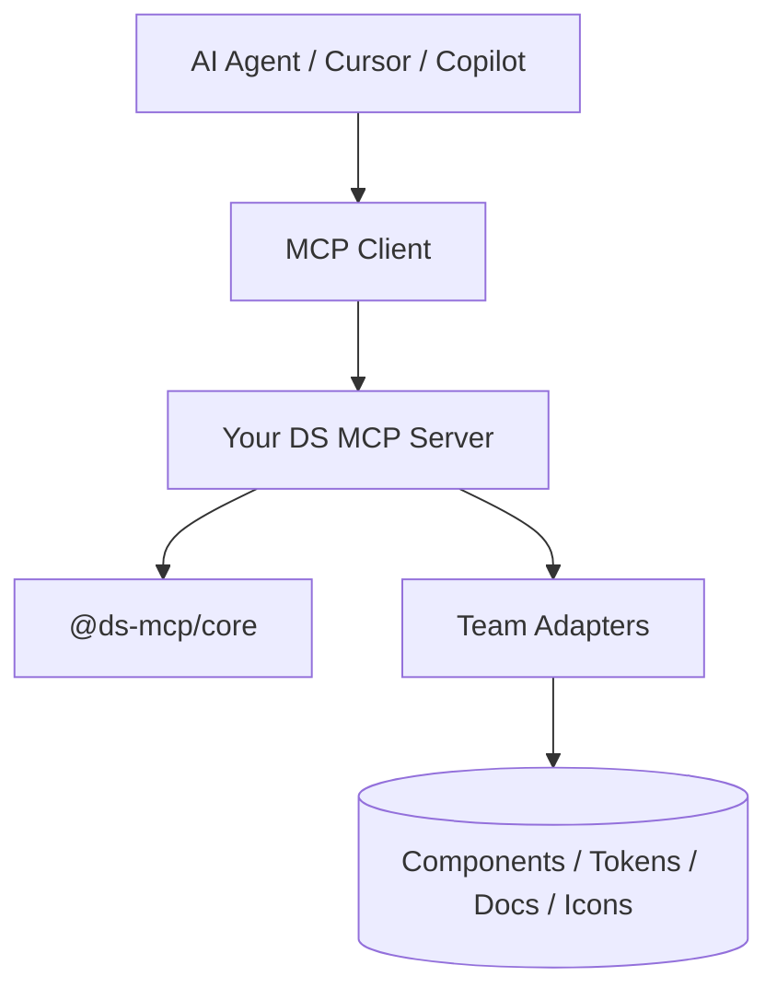

# Design System MCP Kit

[](LICENSE)

Open-source toolkit for building MCP servers that expose your design system to AI agents.

Inspired by GitHub Primer's [`@primer/mcp`](https://primer.style/product/getting-started/foundations/mcp/), structured as:

- **`@ds-mcp/core`** — reusable framework (tools, registry, adapter contracts)
- **`examples/acme-ds-mcp`** — reference implementation you can fork or copy

## Why this exists

Primer solved a specific problem well: give AI agents **authoritative design-system context** instead of hallucinating components, tokens, or accessibility rules.

Most design teams need the same capability, but their sources differ:

- Storybook metadata vs generated JSON vs TypeScript manifests
- Figma tokens vs Style Dictionary vs CSS variables
- Local MDX docs vs remote documentation sites
- Custom lint rules vs Stylelint presets

This kit standardizes the **MCP tool surface** and lets each team plug in **adapters** for their own data sources.

## Architecture



### Layers

| Layer | Responsibility | Team customizes? |
|-------|----------------|------------------|
| **MCP transport** | stdio server, client wiring | Rarely |
| **Tool registry** | Standard tool names + handlers | Enable/disable tools |
| **Adapters** | Read design-system knowledge | **Yes — main work** |
| **Snapshots** | Bundled fallback catalog | Optional bootstrap |

### Standard tools (Primer-compatible surface)

| Category | Tools |
|----------|-------|
| Setup | `init` |
| Components | `list_components`, `get_component`, `get_component_examples`, `get_component_usage_guidelines`, `get_component_accessibility_guidelines` |
| Patterns | `list_patterns`, `get_pattern` |
| Tokens | `find_tokens`, `get_token_group_bundle`, `get_design_token_specs`, `get_token_usage_patterns` |
| Icons | `list_icons`, `get_icon` |
| Foundations | `get_color_usage`, `get_typography_usage`, `coding_guidelines` |
| Review | `review_alt_text`, `lint_css` |

Tools auto-register only when the required adapter is present.

## Quick start

```bash
npm install
npm run build
npm run preview:acme   # opens MCP Inspector to browse and test tools
npm run example:acme   # runs the Acme server on stdio
```

### Cursor / VS Code MCP config

```json
{
  "servers": {
    "Acme Design System": {
      "type": "stdio",
      "command": "node",
      "args": ["/absolute/path/to/design-system-mcp-kit/examples/acme-ds-mcp/dist/index.js"]
    }
  }
}
```

## How teams adopt this

### Phase 1 — Snapshot bootstrap (1–2 days)

1. Copy `examples/acme-ds-mcp` to `packages/your-ds-mcp`
2. Replace `data/catalog.snapshot.json` with your component/token/icon inventory
3. Update `src/config.ts` with your system name, package name, and agent instructions
4. Ship stdio MCP to designers and engineers

Good when you need value fast and docs are still maturing.

### Phase 2 — Live adapters (1–2 weeks)

Replace snapshot adapters with real integrations:

| Adapter | Common sources |
|---------|----------------|
| `ComponentCatalogAdapter` | Storybook `index.json`, generated `components.json`, TS docgen |
| `TokenCatalogAdapter` | Style Dictionary output, `@tokens-studio`, CSS custom properties |
| `DocsAdapter` | MDX docs folder, public docs site (HTML → markdown like Primer) |
| `PatternCatalogAdapter` | CMS, static markdown, Notion export |
| `IconCatalogAdapter` | Icon package manifest |
| `ReviewAdapter` | Stylelint, custom JSX rules, a11y checks |

### Phase 3 — Governance (ongoing)

- CI job publishes refreshed snapshots on design-system releases
- Add custom tools via `extraTools` (e.g. `review_jsx`, `suggest_token`, `migrate_component`)
- Version MCP package alongside design-system semver

## Adapter contract (example)

```ts
import { createDesignSystemMcpServer } from '@ds-mcp/core';

export function createMyServer() {
  return createDesignSystemMcpServer({
    config: {
      name: 'My Design System',
      version: '1.0.0',
      packageName: '@my-org/design-system',
      instructions: 'Always use My DS components and tokens before custom UI.',
    },
    adapters: {
      components: {
        listComponents: () => [...],
        getComponent: (name) => ({ id: 'button', name: 'Button' }),
      },
      tokens: {
        findTokens: (query) => [...],
        getGroupBundle: (group) => ({ id: group, name: group, tokens: [] }),
      },
    },
  });
}
```

## Comparison with Primer MCP

| | Primer `@primer/mcp` | This kit |
|--|---------------------|----------|
| Scope | Primer React only | Any design system |
| Data | Primer packages + primer.style docs | Your adapters |
| Tool names | Primer-specific set | Same standard surface |
| Customization | Fork Primer repo | Config + adapters |
| Best for | GitHub product UI | Enterprise / agency design systems |

Primer Brand also ships a separate [`@primer/brand-mcp`](https://primer.style/brand/introduction/mcp/) with review/setup tools — your framework can add similar custom tools through `extraTools`.

## Recommended repo layout for a team

```text
your-design-system/
├── packages/
│   ├── tokens/
│   ├── react/
│   └── ds-mcp/              # MCP server package
│       ├── data/
│       │   └── catalog.snapshot.json
│       └── src/
│           ├── index.ts
│           ├── config.ts
│           ├── server.ts
│           └── adapters/
│               ├── components.storybook.ts
│               ├── tokens.style-dictionary.ts
│               └── docs.mdx.ts
└── .cursor/mcp.json
```

## Roadmap

- [x] CLI: `npm run create:ds-mcp` generator
- [ ] Storybook adapter template
- [ ] Style Dictionary adapter template
- [ ] Remote docs fetch adapter (cheerio + turndown, like Primer)
- [ ] `review_jsx` tool for design-system compliance
- [ ] GitHub Action to refresh snapshots on release

## Contributing

See [CONTRIBUTING.md](CONTRIBUTING.md). Bug reports and pull requests are welcome.

## License

MIT — see [LICENSE](LICENSE).

## References

- [Primer MCP docs](https://primer.style/product/getting-started/foundations/mcp/)
- [Primer MCP source](https://github.com/primer/react/tree/main/packages/mcp)
- [Primer Brand MCP source](https://github.com/primer/brand/tree/main/packages/mcp)
- [Model Context Protocol](https://modelcontextprotocol.io)
